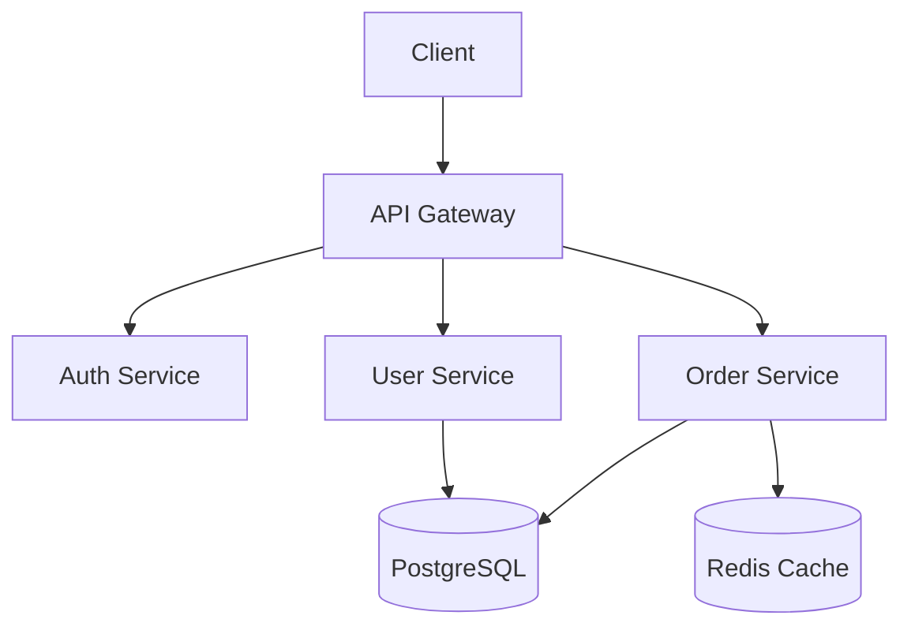
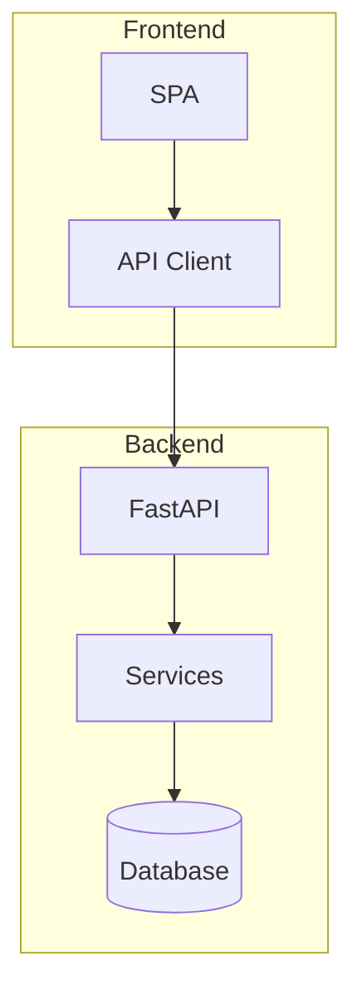
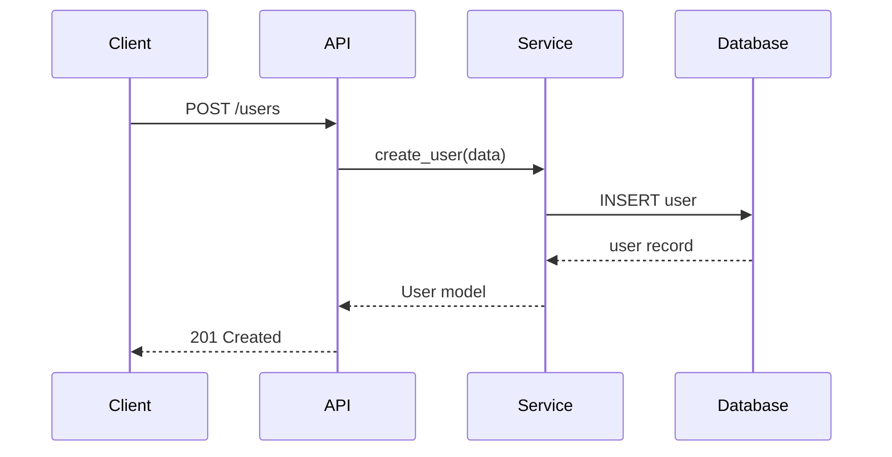
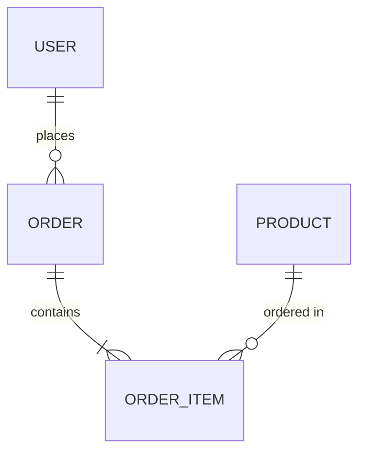
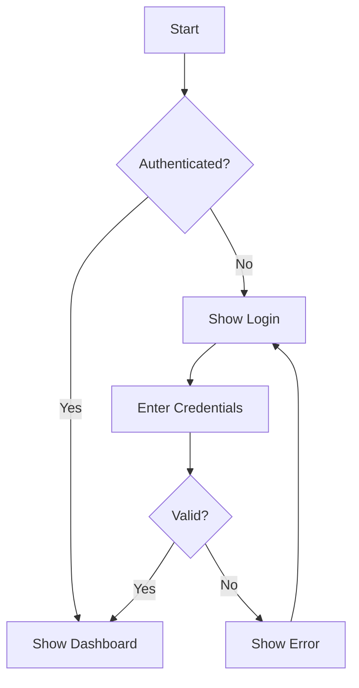

# Plan

Create structured planning documents following Spec-Driven Development
(SDD) methodology. Specifications are the source of truth — code serves
the specification.

## Process

### Phase 1: Requirements Gathering

Understand what needs to be built:

1. Ask the user for the goal, scope, and constraints.
2. Identify stakeholders, users, and key use cases.
3. List functional and non-functional requirements.
4. Identify dependencies (internal and external).
5. Define acceptance criteria — measurable, testable outcomes.

### Phase 2: Architecture Design

Design the system architecture:

1. Choose the architecture pattern (layered, hexagonal, MVC, microservices).
2. Define components and their responsibilities.
3. Map data flow between components.
4. Define API contracts (routes, types, payloads).
5. Choose technology stack and justify decisions.
6. Identify integration points and external services.

Produce a **Mermaid architecture diagram**:

````text

````

### Phase 3: Module Design

Break down into implementable modules:

1. Define each module's interface (inputs, outputs, side effects).
2. Map dependencies between modules.
3. Design data models (entities, DTOs, events).
4. Define API routes with types:

```text
POST /api/users          -> CreateUserRequest  -> UserResponse (201)
GET  /api/users/:id      -> PathParam(id: str) -> UserResponse (200)
PUT  /api/users/:id      -> UpdateUserRequest  -> UserResponse (200)
DELETE /api/users/:id    -> PathParam(id: str) -> None (204)
```

5. If frontend exists, design the UI in ASCII or describe components.

### Phase 4: Create Documents

Generate the planning artifacts as Markdown files.

## Output Artifacts

### SPEC.md — Requirements Specification

```markdown
# SPEC: Feature Name

## Overview

What this feature does and why.

## Requirements

### Functional

- FR-01: Users can search by name or email
- FR-02: Search results paginate (20 per page)

### Non-Functional

- NFR-01: Search responds in < 200ms for 95th percentile
- NFR-02: Supports 1000 concurrent users

## User Flows

1. User enters search query
2. System returns paginated results
3. User clicks result to view detail

## Acceptance Criteria

- [ ] Search returns results matching name or email
- [ ] Empty query returns all users (paginated)
- [ ] Invalid input returns 422 with structured errors

## Edge Cases

- Empty search query
- Special characters in search
- No results found

## Dependencies

- User service (existing)
- PostgreSQL full-text search (new)
```

### ARCH.md — Architecture Document

```markdown
# ARCH: Feature Name

## System Context

Where this fits in the overall system.

## Architecture Decision Records

- ADR-01: Use PostgreSQL FTS over Elasticsearch (simpler, sufficient scale)
- ADR-02: Server-side pagination over cursor-based (simpler UX)

## Component Diagram

(Mermaid diagram here)

## Data Models

(Pydantic models or schema definitions)

## API Design

(Routes, types, status codes)

## Sequence Diagram

(Mermaid sequence diagram for key flows)

## Security Considerations

- Input validation
- Rate limiting
- Authorization checks

## Infrastructure

- Database migrations
- Environment variables needed
- External service dependencies
```

### SDD.md — Software Design Document

```markdown
# SDD: Feature Name

## Foundation

Project principles and constraints.

## Specification

Detailed behavioral specification with examples.

## Architecture

Component design with diagrams.

## Implementation Plan

Ordered list of tasks with dependencies.

## Test Strategy

What to test, how, and coverage targets.

## Design Principles

Code conventions and patterns to follow.
```

## Mermaid Diagrams

Use Mermaid for all visual documentation. Common diagram types:

### Component/Architecture

````text

````

### Sequence Diagram

````text

````

### Entity Relationship

````text

````

### Flowchart (User Flow)

````text

````

## Frontend Planning

When planning frontend components, include:

### ASCII Wireframe

```text
+----------------------------------+
|  Logo    [Search...]    [Avatar] |
+----------------------------------+
|  Sidebar  |  Main Content        |
|           |                      |
|  - Users  |  +---------------+   |
|  - Orders |  | User Card     |   |
|  - Config |  | Name: Alice   |   |
|           |  | Email: a@b.co |   |
|           |  +---------------+   |
|           |                      |
|           |  +---------------+   |
|           |  | User Card     |   |
|           |  | Name: Bob     |   |
|           |  +---------------+   |
+----------------------------------+
```

### Component Tree

```text
App
├── Layout
│   ├── Header (logo, search, avatar)
│   ├── Sidebar (navigation)
│   └── Main
│       ├── UserList
│       │   └── UserCard[]
│       └── Pagination
└── AuthGuard
```

## What NOT to Do

- **Do not implement during planning.** Planning produces documents, not code.
- **Do not over-specify.** Leave room for implementation decisions.
- **Do not skip diagrams.** Visual representations catch design issues early.
- **Do not plan alone.** Validate assumptions with the user at each phase.

## Checklist

Before finishing a plan, verify:

- [ ] All requirements have acceptance criteria
- [ ] Architecture diagram exists
- [ ] API routes defined with types
- [ ] Data models specified
- [ ] Dependencies identified
- [ ] Edge cases listed
- [ ] Test strategy outlined
- [ ] Security considerations addressed
